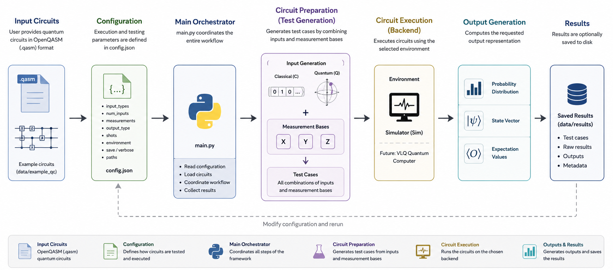

# LUMI-Q WP4 Quantum Software Testing Framework


This repository contains the reference implementation developed by **Simula Research Laboratory** within Work Package 4 (WP4) of the **LUMI-Q** project. It provides a framework for the execution and testing of quantum circuits as part of the LUMI-Q software stack. The repository contributes to **Work Package 4 (WP4) – Full Software Stack and User Interface**, with a particular focus on the integration of a **quantum software testing framework** into the LUMI-Q software stack. The framework aims to support the development, execution, validation, and testing of quantum applications within hybrid HPC+QC workflows.

As the LUMI-Q project progresses, the repository will evolve to include additional functionality, integrations, and documentation.

## Table of Contents

- [Current Status](#current-status)
- [Current Features](#current-features)
- [Repository Structure](#repository-structure)
- [Configuration](#configuration)
- [Installation](#installation)
- [Usage](#usage)
- [Roadmap](#roadmap)


# Framework Overview

The repository currently provides a modular framework for executing and testing quantum circuits in a **simulated environment** or the real **VLQ** Quantum Computer.

Users only need to provide an OpenQASM (`.qasm`) circuit, while the framework manages circuit preparation, execution, and output collection. The architecture has been designed to facilitate integration with the **VLQ** quantum computer, enabling direct execution on quantum hardware.

The following figure illustrates the execution workflow of the framework, from loading an OpenQASM circuit to generating and storing the execution results.



# Features

### Quantum Circuit Execution

- Execution of quantum circuits from OpenQASM (`.qasm`) files.
- Simulation-based execution backend.
- Integration with the VLQ quantum computer for real execution.

### Quantum Software Testing

The framework currently supports automated testing of quantum circuits through:

- Automatic test case generation.
- Automated execution of generated test cases.
- Classical state initialization.
- Quantum state initialization.
- Measurements in the **X**, **Y**, and **Z** bases.

### Supported Outputs

Execution results can be retrieved as:

- Probability distributions
- State vectors
- Expectation values

Note that for the **VLQ** real quantum execution only probability distribution are available currently.

# Repository Structure

The current implementation is organized into a small set of core modules that together provide the execution and testing workflow.

```text
.
├── data/
│   ├── example_qc/
│   └── results/
├── main.py
├── circuit_execution.py
├── circuit_preparation.py
├── config.json
├── requirements.txt
└── README.md
```

### `main.py`

Entry point of the framework. This script orchestrates the complete workflow by reading the user configuration, preparing the quantum circuit and test cases, executing the selected backend, and collecting the requested outputs.

### `circuit_execution.py`

Implements the quantum circuit execution backend. The module is responsible for loading and executing OpenQASM (`.qasm`) circuits and retrieving the selected output representation (probability distributions, state vectors, or expectation values).

The current implementation conatines a QiskitAer simulation backend and supports direct execution on the **VLQ** quantum computer.

### `circuit_preparation.py`

Responsible for preparing quantum circuits for testing. This module generates the required test cases, creates the corresponding classical or quantum initializations, applies the selected measurement basis, and combines these elements with the original quantum circuit before execution.

### `config.json`

Configuration file used to customize the framework execution. Users can specify the input circuit, testing configuration, initialization strategy, measurement basis, output representation, and execution backend.

### `data/`

Contains example OpenQASM (`.qasm`) circuits that demonstrate the framework's functionality. These examples can be used for testing or as templates for user-defined quantum circuits.

# Configuration

The framework is configured through the `config.json` file, which defines the testing strategy, execution backend, and output options.

```json
{
    "input_types": ["C", "Q"],
    "num_inputs": 4,
    "measurements": ["X", "Y", "Z"],

    "output_type": "Prob",
    "shots": 1024,
    "environment": "Sim",

    "save": true,
    "verbose": true,

    "results_path": "data/results",
    "origin_path": "data/example_qc",

    "PROJECT": "PROJECT id",
    "RESOURCE": "RESOURCE id"
}
```

The available configuration parameters are described below.

| Parameter | Description |
|-----------|-------------|
| `input_types` | Specifies the types of test inputs to generate. `"C"` generates **classical initializations**, while `"Q"` generates **quantum initializations**. Both can be selected simultaneously. |
| `num_inputs` | Number of inputs to generate in total. Will be divided equally between the input types selected |
| `measurements` | Measurement bases used during testing. The framework currently supports the Pauli bases **X**, **Y**, and **Z**. Multiple bases can be specified. |
| `output_type` | Determines the execution output returned by the framework. Supported values are: `"Prob"` (probability distribution), `"State"` (quantum state vector), and `"Exp"` (expectation values). |
| `shots` | Number of shots (repeated circuit executions) used when sampling measurement results. This parameter is primarily relevant for probability-based outputs and hardware execution. |
| `environment` | Execution backend. Currently supported: `"Sim"` for simulator execution. Future versions will support execution on the **VLQ** quantum computer. |
| `save` | If `true`, execution results are saved to the directory specified by `results_path`. |
| `verbose` | Enables detailed console output during execution for monitoring and debugging purposes. |
| `results_path` | Directory where generated results and execution outputs are stored. |
| `origin_path` | Directory containing the input OpenQASM (`.qasm`) circuits to be executed. |
| `PROJECT` | The project id associated to the relevant project for the VLQ machine execution, e.g. OPEN-37-1 |
| `RESOURCE` | The resource id associated to the relevant project for the VLQ machine execution, e.g. VLQ-CZ |

### Example

The configuration shown above will:

- Generate **2 classical** and **2 quantum** test inputs.
- Execute each circuit using measurements in the **X**, **Y**, and **Z** bases, generating a total of 12 test cases (4 inputs in 3 basis).
- Return the **probability distribution** of the results.
- Execute the circuits using the **simulator** backend.
- Save the generated results in `data/results`.
- Read the input circuits from `data/example_qc`.

For more information regarding the execution on the real **VLQ** Quantum COmputer please refer to [Documentation](https://docs.it4i.cz/en/docs/clusters/vlq/access)

# Installation

### Requirements

The framework has been developed and tested with the following software versions:

| Software | Version |
|----------|---------|
| Python | 3.11 |
| NumPy | 2.4.6 |
| Pandas | 2.3.3 |
| Qiskit | 1.4.5|
| Qiskit Aer | 0.17.2 |
| tqdm | 4.69.0 |
| py4lexis | 7.0.6 |
| qaas | 0.3.2 |

The dependencies can be installed from a `requirements.txt` file:

```bash
pip install -r requirements.txt
```

# Usage

The framework is configured entirely through the `config.json` file. Once the desired parameters have been specified, no additional command-line arguments are required.

To execute the framework, simply run the main script:

```bash
python main.py
```

Alternatively, the `main.py` script can be executed directly from your preferred Python IDE.

During execution, the framework will:

1. Read the execution parameters from `config.json`.
2. Load the input OpenQASM (`.qasm`) circuits from the configured `origin_path`.
3. Generate the requested test cases.
4. Execute the circuits using the selected execution environment.
5. Compute the requested output representation.
6. Save the generated results to the configured `results_path` (if `save` is enabled).

# Roadmap

The repository is under active development. Planned future work includes:

- Extension of the quantum software testing framework.
- Additional testing methodologies and validation workflows.
- Improved documentation and usage examples.

# License

This repository is part of the LUMI-Q project. Licensing information will be added upon public release.